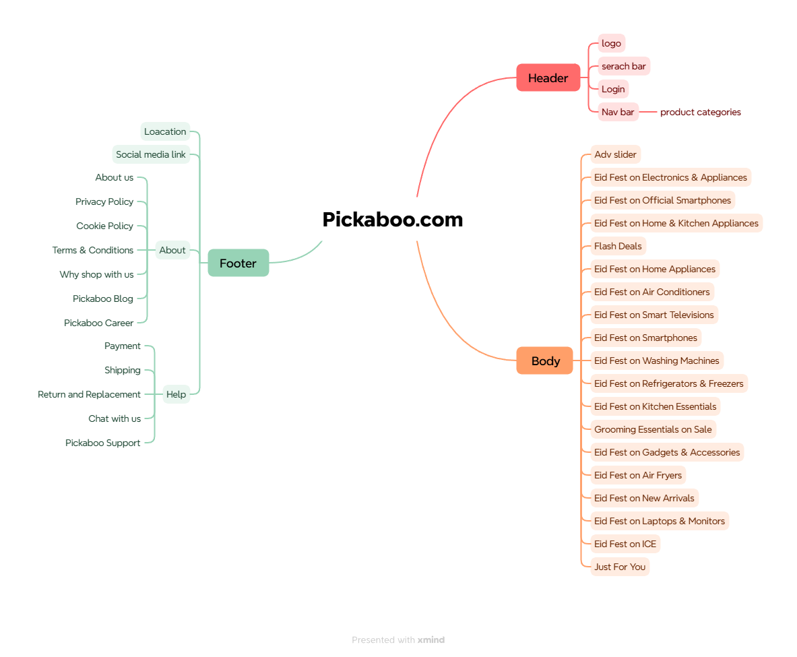
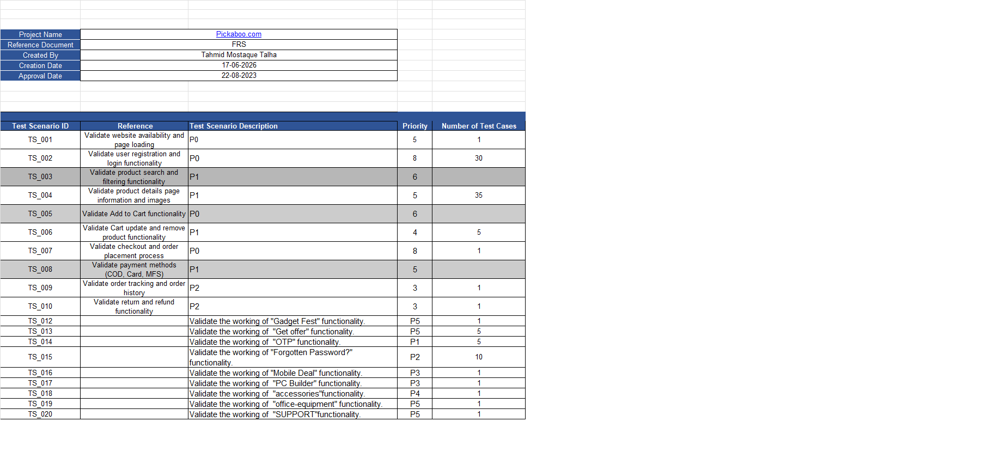
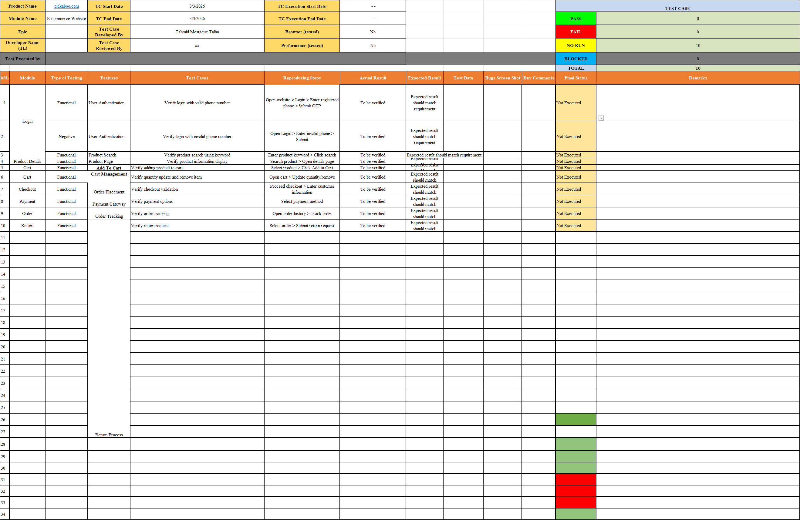
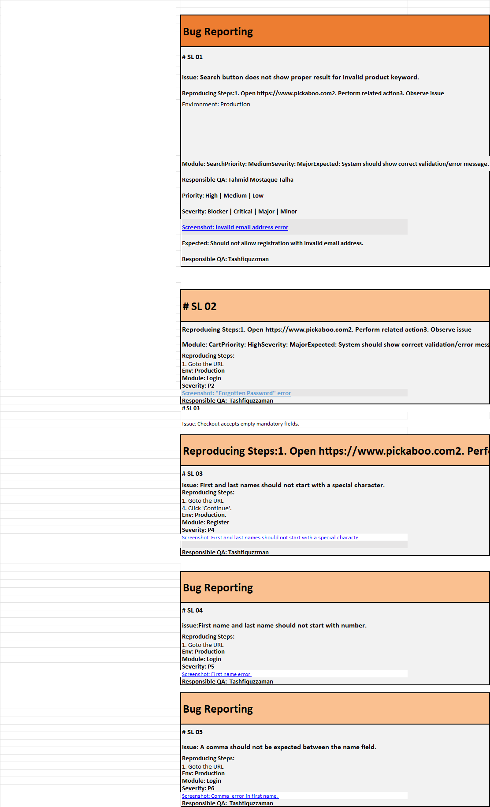
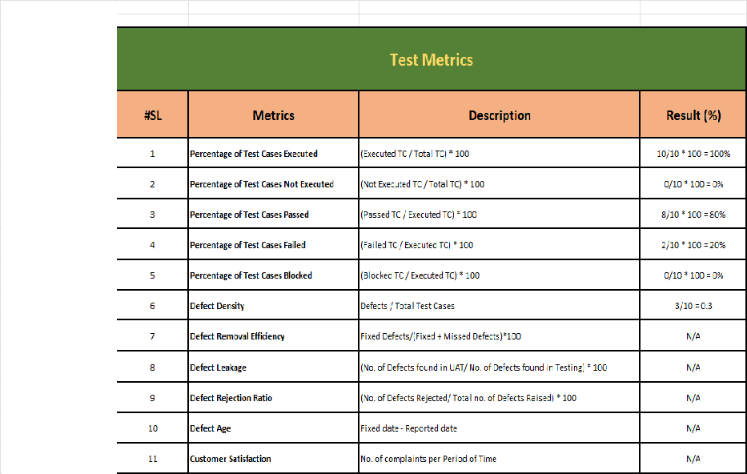

# Pickaboo.com Manual Testing Project

# Project Overview

This repository contains a complete **Manual Software Testing Project** performed on **Pickaboo.com**, an e-commerce website.

The objective of this project was to analyze the website structure, identify important user flows, create test scenarios, design test cases, report defects, and prepare test execution metrics.

---

# Application Under Test

**Website:** Pickaboo.com

**Application Type:** E-commerce Website

# Testing Scope

The following testing activities were performed:

- Manual Testing
- Functional Testing
- UI Testing
- Exploratory Testing
- Regression Testing

---

# Website Analysis

Before preparing test cases, the Pickaboo website was analyzed to identify major modules and user journeys.

## Identified Modules

### Header Module

- Logo
- Search Bar
- Login
- Product Category Navigation

### Homepage Module

- Advertisement Slider
- Promotional Campaigns
- Flash Deals
- Product Categories
- Product Sections

### Footer Module

- About Us
- Privacy Policy
- Cookie Policy
- Terms & Conditions
- Blog
- Career

### Help & Support Module

- Payment Information
- Shipping Information
- Return and Replacement
- Customer Support

## Website Analysis Mind Map

---

# Test Documentation

## Test Scenario

High-level test scenarios were prepared to define testing coverage.

Covered areas:

- Website availability
- Authentication
- Product browsing
- Cart functionality
- Checkout process
- Order management

---

# Test Cases

Detailed test cases were created for important user functionalities.

Covered functionalities:

- User Login
- Product Search
- Product Details
- Add To Cart
- Cart Management
- Checkout
- Payment
- Order Tracking
- Return Process

---

# Bug Report

Defects were documented using standard QA reporting format.

Bug report contains:

- Bug ID
- Description
- Module
- Severity
- Priority
- Steps to Reproduce
- Expected Result
- Actual Result

---

# Test Metrics

Testing metrics were prepared to evaluate test execution status.

Metrics include:

- Test Case Execution Percentage
- Pass Percentage
- Fail Percentage
- Defect Density
- Defect Removal Efficiency
- Defect Leakage

---

# Test Summary Report

## Testing Result

| Metric | Result |
|---|---|
| Total Test Cases | 10 |
| Executed Test Cases | 10 |
| Passed Test Cases | 8 |
| Failed Test Cases | 2 |
| Reported Defects | 3 |

---

# Tools Used

| Tool | Purpose |
|-|-|
| Excel | Test Documentation |
| Browser | Website Testing |
| Jira Knowledge | Bug Reporting |
| GitHub | Project Management |

---

# Repository Structure

---

# Skills Demonstrated

- Test Case Design
- Test Scenario Creation
- Functional Testing
- Bug Reporting
- Test Documentation
- QA Reporting

---

# Author

**Tahmid Mostaque Talha**

Junior QA Engineer
